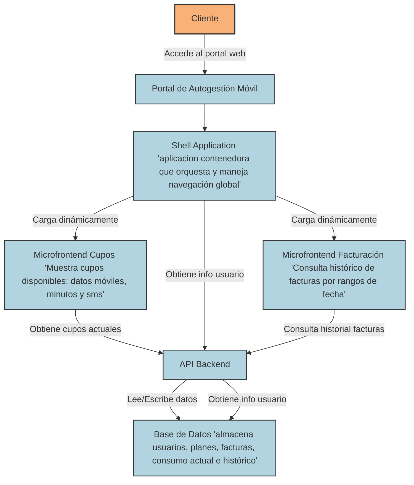

# Prueba Técnica - Desarrollador Fullstack

## Contexto del Proyecto
Desarrollar un portal de autogestión para clientes de telefonía móvil utilizando arquitectura de microfrontends, donde diferentes equipos puedan desarrollar y desplegar módulos independientemente.

---

## Objetivo Principal
Demostrar competencias en:
- Arquitectura e implementación de microfrontends
- Desarrollo fullstack con Next.js+TypeScript y Spring Boot
- Diseño de APIs RESTful
- Contenerización con Docker
- Código limpio y buenas prácticas

---

## Arquitectura del Sistema

La arquitectura se basa en microfrontends independientes que se comunican a través de una Shell Application y consumen servicios de un backend centralizado.

---

## Funcionalidades Requeridas

**Premisa:** El usuario tiene una línea telefónica activa y accede con su número de identificación. Puedes asumir que el usuario ya está autenticado o simular una autenticación básica.

### 1. Shell Application (Contenedor Principal)
- Navegación global entre microfrontends (menú)
- Header común con información del usuario
- Lazy loading de microfrontends
- Routing dinámico entre módulos

### 2. Microfrontend: Cupos disponibles
- Muestra el estado actual de consumo del usuario comparado con los límites de su plan:
  - Cupos disponibles: megas/internet, minutos, mensajes de texto (color rojo – representación de consumo)
- Los cálculos de consumo se realizan en el backend.

### 3. Microfrontend: Billing (Facturación)
- Historial de facturas (consulta por rango de fechas)
- Opcional: funcionalidad de “Descargar” y buscar en la tabla

---

## Especificaciones Técnicas

### Frontend
- Framework Principal: React v18+ y Next.js 14+
- Lenguaje: TypeScript 5.x
- Arquitectura Microfrontends: Module Federation, Multi Zone o propuesta propia
- Estilos: Tailwind CSS o preferencia
- Estado: Zustand, Redux Toolkit o solución propuesta
- Testing*: Vitest + React Testing Library (opcional)

### Backend
- Framework: Spring Boot 3.x
- Lenguaje: Java 17+
- Arquitectura: Clean Architecture, Hexagonal o preferencia
- APIs: RESTful
- Base de Datos: PostgreSQL
- ORM: Hibernate/JPA

### Infraestructura
- Containerización: Docker + Docker Compose
- Base de Datos: Contenerizada o servicio cloud con datos de prueba
- Documentación: README detallado con instrucciones

---

## Modelo de Datos Sugerido

- Tabla Usuarios
  - users (id, account_number, number_id, phone_number, name, email, plan_id, created_at)
- Tabla Planes
  - plans (id, name, price, data_gb, minutes, sms, description)
- Tabla Facturas
  - bills (id, user_id, plan_id, period, amount, due_date, issue_date, created_at)
- Tabla Consumos
  - usage (id, user_id, data_gb, minutes, sms, last_updated)

---

## Endpoints API Requeridos

### Usuarios
- `GET /api/users/{number_id}` - Obtener información del usuario

### Cupos Disponibles
- `GET /api/users/{user_id}/usage` - Obtener cupos disponibles y consumo actual

### Facturación
- `GET /api/users/{user_id}/bills?startdate=01/01/2024&enddate=31/10/2024` - Historial de facturas

*Puedes crear más endpoints si son requeridos.*

---

## Entregables

1. Código fuente en repositorio Git (GitHub/GitLab)
2. README detallado con:
   - Instrucciones de instalación y ejecución con Docker o docker-compose
   - Estrategia de microfrontends implementada y justificación
   - Comandos para levantar la aplicación completa

---

## Puntos Bonus (Opcionales)
- Performance: Métricas de carga, optimizaciones específicas
- CI/CD: Pipeline para despliegue independiente de microfrontends

---

## Notas Finales
Esta prueba busca evaluar tu capacidad para diseñar e implementar soluciones complejas en un entorno empresarial real. Prioriza la calidad sobre la cantidad de funcionalidades. 