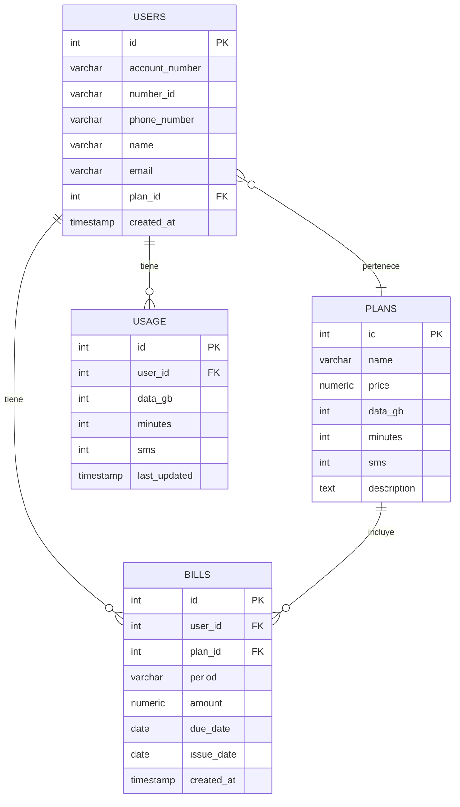

# Modelo Entidad-Relación - Base de Datos

## Descripción

La base de datos utiliza PostgreSQL y está diseñada para soportar el portal de autogestión móvil. El modelo sigue la estructura sugerida en la prueba técnica, permitiendo almacenar usuarios, planes, facturación y consumos.

---

## Diagrama Entidad-Relación (ER)



---

## Descripción de Tablas

### USERS
- id: Identificador único
- account_number: Número de cuenta
- number_id: Número de identificación (cédula)
- phone_number: Número de teléfono
- name: Nombre completo
- email: Correo electrónico
- plan_id: Relación al plan contratado
- created_at: Fecha de creación

### PLANS
- id: Identificador único
- name: Nombre del plan
- price: Precio
- data_gb: Cupo de datos en GB
- minutes: Cupo de minutos
- sms: Cupo de mensajes
- description: Descripción

### BILLS
- id: Identificador único
- user_id: Relación al usuario
- plan_id: Relación al plan
- period: Periodo de facturación
- amount: Monto
- due_date: Fecha de vencimiento
- issue_date: Fecha de emisión
- created_at: Fecha de creación

### USAGE
- id: Identificador único
- user_id: Relación al usuario
- data_gb: Consumo de datos
- minutes: Consumo de minutos
- sms: Consumo de mensajes
- last_updated: Última actualización

---

## Notas
- Las relaciones están normalizadas para facilitar consultas y reportes.
- Puedes modificar el modelo según necesidades futuras del negocio. 

---

## Script SQL de Creación y Población Inicial

```sql
-- Crear tablas
CREATE TABLE plans (
  id SERIAL PRIMARY KEY,
  name VARCHAR(100) NOT NULL,
  price NUMERIC(10,2) NOT NULL,
  data_gb INTEGER NOT NULL,
  minutes INTEGER NOT NULL,
  sms INTEGER NOT NULL,
  description TEXT
);

CREATE TABLE users (
  id SERIAL PRIMARY KEY,
  account_number VARCHAR(50) NOT NULL,
  number_id VARCHAR(20) NOT NULL,
  phone_number VARCHAR(20) NOT NULL,
  name VARCHAR(100) NOT NULL,
  email VARCHAR(100) NOT NULL,
  plan_id INTEGER REFERENCES plans(id),
  created_at TIMESTAMP DEFAULT CURRENT_TIMESTAMP
);

CREATE TABLE bills (
  id SERIAL PRIMARY KEY,
  user_id INTEGER REFERENCES users(id),
  plan_id INTEGER REFERENCES plans(id),
  period VARCHAR(20) NOT NULL,
  amount NUMERIC(10,2) NOT NULL,
  due_date DATE NOT NULL,
  issue_date DATE NOT NULL,
  created_at TIMESTAMP DEFAULT CURRENT_TIMESTAMP
);

CREATE TABLE usage (
  id SERIAL PRIMARY KEY,
  user_id INTEGER REFERENCES users(id),
  data_gb INTEGER NOT NULL,
  minutes INTEGER NOT NULL,
  sms INTEGER NOT NULL,
  last_updated TIMESTAMP DEFAULT CURRENT_TIMESTAMP
);

-- Poblar datos de prueba
INSERT INTO plans (name, price, data_gb, minutes, sms, description) VALUES
  ('Plan Básico', 10.00, 5, 100, 50, 'Plan básico para usuarios de bajo consumo'),
  ('Plan Intermedio', 20.00, 20, 500, 200, 'Plan intermedio para usuarios promedio'),
  ('Plan Premium', 35.00, 50, 2000, 1000, 'Plan premium para usuarios exigentes');

INSERT INTO users (account_number, number_id, phone_number, name, email, plan_id) VALUES
  ('ACC001', '12345678', '5551001001', 'Juan Pérez', 'juan.perez@email.com', 1),
  ('ACC002', '87654321', '5551001002', 'Ana Gómez', 'ana.gomez@email.com', 2),
  ('ACC003', '11223344', '5551001003', 'Carlos Ruiz', 'carlos.ruiz@email.com', 3);

INSERT INTO usage (user_id, data_gb, minutes, sms) VALUES
  (1, 2, 40, 10),
  (2, 10, 200, 50),
  (3, 30, 1500, 500);

INSERT INTO bills (user_id, plan_id, period, amount, due_date, issue_date) VALUES
  (1, 1, '2024-01', 10.00, '2024-02-10', '2024-01-31'),
  (1, 1, '2024-02', 10.00, '2024-03-10', '2024-02-29'),
  (2, 2, '2024-01', 20.00, '2024-02-10', '2024-01-31'),
  (3, 3, '2024-01', 35.00, '2024-02-10', '2024-01-31');
``` 